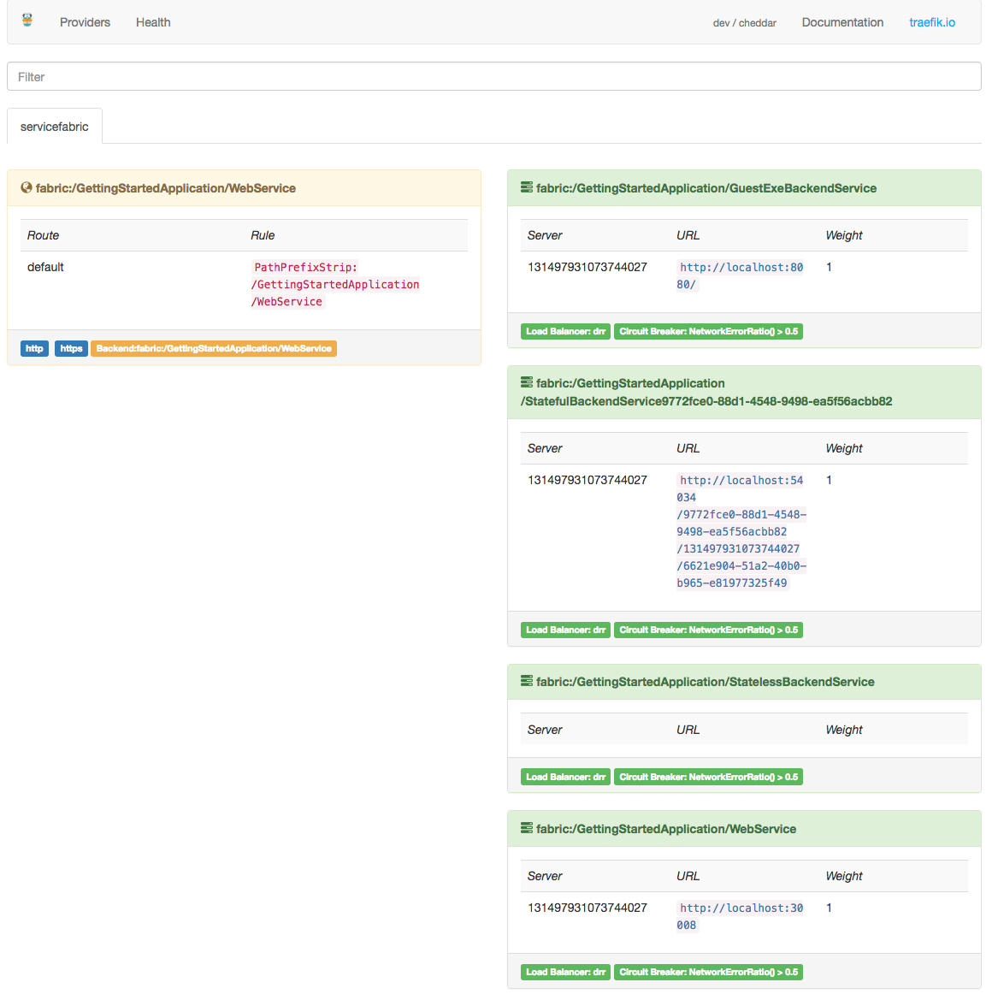

> **Disclaimer:**
This project is under heavy development and deployment instructions are likely to be outdated during the current sprint, lasting until early December.

# Running Træfik on Service Fabric

## What is Træfik?
Træfik (pronounced like traffic) is a modern HTTP reverse proxy and load balancer made to deploy microservices with ease. It supports several backends (Docker, Swarm mode, Kubernetes, Marathon, Consul, Etcd, Rancher, Amazon ECS, and a lot more) to manage its configuration automatically and dynamically.
For more information, visit the [Træfik homepage](https://traefik.io/)

## What is Service Fabric?
Azure Service Fabric is a distributed systems platform that makes it easy to package, deploy, and manage scalable and reliable microservices and containers.
For more information, visit the [Service Fabric homepage](https://azure.microsoft.com/en-gb/services/service-fabric/)

## Why run Træfik on Service Fabric?
Integrating Træfik and Service Fabric allows you to configure much more advanced, yet flexible, ingress routing scenarios for your Service Fabric hosted services and applications. You get all the benefits of using Træfik to configure your routing whilst also getting the benefits of Service Fabric's packaging model.

# Deploying Træfik to Service Fabric (Windows)
First things first, make sure you have a Service Fabric cluster up and running, either remotely or using the local development environment. Instructions on doing this can be found on the [Service Fabric documentation page](https://docs.microsoft.com/en-gb/azure/service-fabric/).

## Prerequisites
- Visual Studio 2015 or greater with Service Fabric tooling.
- OpenSSL for Windows
> These prerequisites are for following the instructions and are not required for running Træfik on Service Fabric.

## Instructions
1. Clone this repository to your local machine.
    
    `git clone https://github.com/jjcollinge/traefik-on-service-fabric.git`

2. Download the Træfik binary into the solution by running the following PowerShell script.

    `./$REPO_ROOT/Traefik/Scripts/Get-TraefikBinary.ps1`

    > This script will use a specific build from this repository's release list. To override the build's download URL, provide the `-url` parameter to the script.

3. Open the `Traefik.sln` file in Visual Studio

    **If you're working against a local development cluster or don't require a secure cluster, skip to step 7.**

4. Træfik must authenticate to the Service Fabric management API. Currently, you can only do this using a PEM formatted client certificate. If you only have a `.pfx` certificate you will need to convert it using the following commands:
    
    * Extract the private key from the `.pfx` file

        `openssl pkcs12 -in $pfxCertFilePath -nocerts -nodes -out "$clientCertOutputDir\servicefabric.key" -passin pass:$certPass`

    * Extract the certificate from the `.pfx` file

        `openssl pkcs12 -in $pfxCertFilePath -clcerts -nokeys -out "clientCertOutputDir\servicefabric.crt" -passin pass:$certPass`
    
    > Træfik *only* requires read-only access to the Service Fabric API and thus you should use a `Read-Only` certificate.

5. Copy your generated certificate files to the `Code\certs` folder Træfik expects to find them in.

    `cp $clientCertOutputDir\* $REPO_ROOT\Traefik\ApplicationPackageRoot\TraefikPkg\Code\certs`

6. If you wish to track the new certificate files in Visual Studio, you'll need to add them to your solution by right clicking on the `$REPO_ROOT\Traefik\ApplicationPackageRoot\TreafikPkg\Code\certs` folder and selecting `Add Existing Item...`, navigate to the certificates on local disk and select `Add`.

7. Open `$REPO_ROOT\Traefik\Traefik\ApplicationPackageRoot\TraefikPkg\Code\traefik.toml` in a text editor. If you're using a secure cluster, ensure the TLS configuration section is uncommented and make sure the provided certificate paths are correct.

> The `clustermanagementurl` setting is relative to where Træfik is running. If Træfik is running inside the cluster on every node, the `clustermanagementurl` should be left as `https://localhost:19080`, if however, Træfik is running externally to the cluster, an accessible endpoint should be provided. If you are testing Traefik against an unsecure cluster, like your local onebox cluster, use `http://localhost:19080`

```toml
################################################################
# Service Fabric provider
################################################################

# Enable Service Fabric configuration backend
[servicefabric]

# Service Fabric Management Endpoint
clustermanagementurl = "https://localhost:19080"

# Service Fabric Management Endpoint API Version
apiversion = "3.0"

# Enable TLS connection.
#
# Optional
#
# [serviceFabric.tls]
#   cert = "certs/servicefabric.crt"
#   key = "certs/servicefabric.key"
#   insecureskipverify = true
```

8. *Optional*  You can choose to enable a watchdog service which will report stats and check Traefik is routing by sending synthetic requests and recording the results. The results of these checks are sent to Application Insights. If you would like this enabled follow [the guide here before continuing](Docs/EnableWatchdog.MD).

9. You can now simply publish Træfik from Visual Studio like any other Service Fabric application. Right click on the project, select `Publish` and follow the publication wizard. 

10. To be able to ingress external requests via Træfik you'll need to open up and map the relevant ports on your public load balancer. For clusters on Azure, this will be your Azure Load Balancer. The default ports are; `tcp/80` (proxy) and `tcp/8080` (API) but these can be configured in `$REPO_ROOT\Traefik\ApplicationPackageRoot\TraefikPkg\Code\traefik.toml` and in `$REPO_ROOT\Traefik\Traefik\ApplicationPackageRoot\TraefikPkg\ServiceManifest.xml`.

11. Once the load balancer has been configured to route traffic on the required ports, you should be able to visit the Træfik dashboard at http[s]://[clusterfqdn]:8080 if you have it enabled.

    

> If your cluster does not have any applications deployed, you will see an empty dashboard. **NOTE:** The dashboard will not render in various versions of Internet Explorer.

# Exposing a Service Fabric Application
Træfik uses the concept of **labels** to configure how services are exposed.

> Labels allow you to define additional metadata for your services which Træfik can use to configure itself dynamically.

## Adding Service labels
In order to assign labels for your service, you can add `Extensions` to your service's `ServiceManifest.xml`. Træfik will select any labels prefixed with `traefik`. Here is an example of using extensions to add Træfik labels:

```xml
<StatelessServiceType ServiceTypeName="WebServiceType">
  <Extensions>
      <Extension Name="Traefik">
        <Labels xmlns="http://schemas.microsoft.com/2015/03/fabact-no-schema">
          <Label Key="traefik.frontend.rule.example">PathPrefixStrip: /a/path/to/strip</Label>
          <Label Key="traefik.expose">true</Label>
          <Label Key="traefik.frontend.passHostHeader">true</Label>
        </Labels>
      </Extension>
  </Extensions>
</StatelessServiceType>
```

## Dynamically updating Service labels
Once you've deployed your service with some default labels, you may need to change the way Træfik is routing requests without redeploying. You can overwrite and add new labels to a named service using Service Fabric's Property Management API. Træfik will then pick up these new/updated labels and reconfigure itself.

### Setting a label dynamically using curl
```bash
curl -X PUT \
  'http://localhost:19080/Names/GettingStartedApplication2/WebService/$/GetProperty?api-version=6.0&IncludeValues=true' \
  -d '{
  "PropertyName": "traefik.frontend.rule.default",
  "Value": {
    "Kind": "String",
    "Data": "PathPrefixStrip: /a/path/to/strip"
  },
  "CustomTypeId": "LabelType"
}'
```

> WARNING: The json provided in the body is case sensitive

### Setting a label dynamically using sfctl
A future release of [sfctl](https://docs.microsoft.com/en-us/azure/service-fabric/service-fabric-cli) will allow you to operate with properties without make raw HTTP requests. There is an outstanding PR [here](https://docs.microsoft.com/en-us/azure/service-fabric/service-fabric-cli) if you wish to try this right away.

```bash
sfctl property put --name "GettingStartedApplication/WebService" --property-description "{\"PropertyName\":\"traefik.frontend.rule.default\",\"Value\":{\"Kind\":\"String\",\"Data\":\"PathPrefixStrip: /a/path/to/strip\"}}"
```

### Available Labels
The current list of available labels is documented [here](https://master--traefik-docs.netlify.com/configuration/backends/servicefabric/). This is subject to change as we expand our capabilities.

## Debugging 
Both services will output logs to `stdout` and `stderr`. To enable these logs uncomment the `ConsoleRedirection` line in both `ServiceManifest.xml` files. 

``` xml
    <ExeHost>
        <Program>traefik-appinsights-watchdog.exe</Program>
        <Arguments>--appinsightskey=__YOUKEYHERE__ --watchdogtestserverport=29001 --pollintervalsec=60 --debug=true</Arguments>
        <WorkingFolder>CodePackage</WorkingFolder>
        <!-- <ConsoleRedirection FileRetentionCount="5" FileMaxSizeInKb="2048" /> -->
    </ExeHost>
```

Once deployed, logs will be stored in the nodes Service Fabric folder. This will be similar to `D:\SvcFab\_App\TraefikType_App1\log` but may vary depending on your configuration.

#### Common Issues

- Service Fabric Provider not shown in Traefik Dashboard: Check you have correctly configured the certificates and clustermanagementurl
- No events showing in App Insights for Traefik: Check you have uncommented the default services section and double check your instrumentation key is correct

## Custom Templates
> For advanced users only

If the default configuration the Service Fabric Træfik provider builds is not sufficient for your needs, you can write a custom template that the provider will use instead. Documentation on how to write a custom template is available [here](https://docs.traefik.io/configuration/commons/#override-default-configuration-template). Your custom template will need to be added to either your application's `Code` or `Config` folders and the relative URL provided in the traefik.toml configuration.
The functions available for you to use in your custom template are documented [here](https://github.com/jjcollinge/traefik-on-service-fabric/blob/master/Docs/CustomTemplates.MD)

## How does Træfik on Service Fabric work?
Træfik is hosted as a Service Fabric Guest Executable. Træfik has a built-in Service Fabric [provider](https://github.com/containous/traefik/tree/master/provider) which will query the Service Fabric management API to discover what services are currently being hosted in the cluster (referred to as `backends`). The provider then maps routing rules (known as `frontends`) to these service instances (referred to as `backends`). Ingress flows in via `entrypoints` (http, https, etc.), `frontends` are then applied to [match](https://docs.traefik.io/basics/#matchers) and [modify](https://docs.traefik.io/basics/#modifiers) each requests before load balancing across the associated `backends`. The provider will take into account the `Health` and `Status` of each of the services to ensure requests are only routed to healthy service instances.

To learn more about how Træfik works and how you can configure is, please [see their documentation](https://docs.traefik.io/basics/).

## Updating Traefik
If you would like to update the Træfik binary, certs or traefik.toml file. You can use Service Fabric's built in 'rolling updates' as you would with any other application package.

## Related Repositories
- Traefik Service Fabric provider development: https://github.com/containous/traefik-extra-service-fabric
- Go SF Management SDK: https://github.com/jjcollinge/servicefabric
- sfctl for property management: https://github.com/Azure/service-fabric-cli/pull/53
- Application Insights Watchdog: https://github.com/lawrencegripper/traefik-appinsights-watchdog
